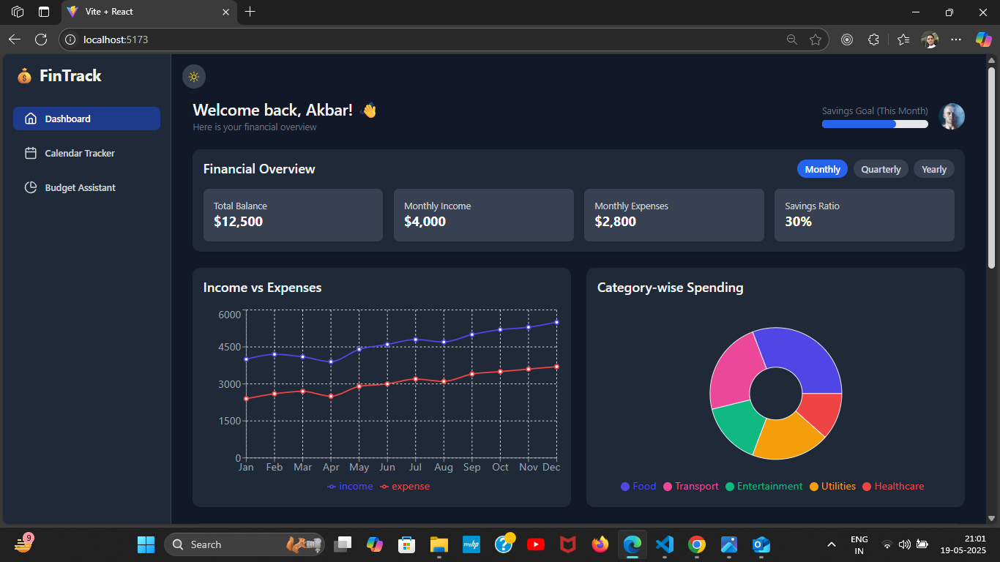
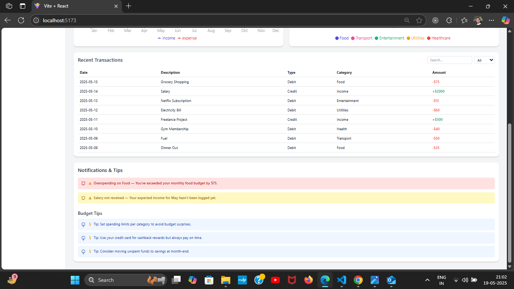
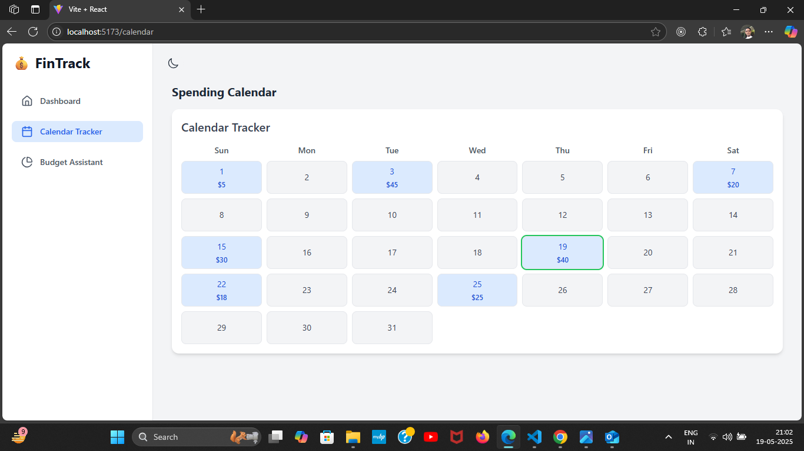
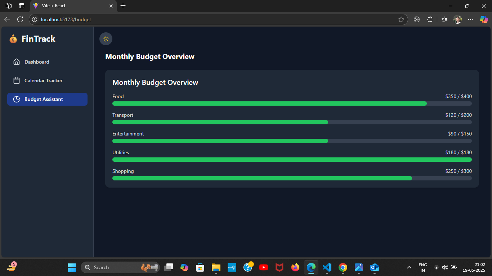

# 💰 Personal Finance Dashboard

A responsive and interactive personal finance dashboard built using **React**, **Vite**, and **Tailwind CSS**. This app visualizes user financial data with charts, cards, tables, and trackers — ideal for client-facing and admin financial dashboards.

---

## 📸 Screenshots









> 📷 Reference UI screenshots based on assignment requirements.

---

## 🧩 Features

✅ Personalized greeting and profile  

✅ Monthly savings goal tracker  

✅ Financial overview cards (monthly, quarterly, YTD toggle) 

✅ Expense vs Income chart (line/area chart) 

✅ Category-wise spending pie chart (with drill-down) 

✅ Recent transactions table (filter, search, color-coded)

✅ Calendar-based spending tracker 📅  

✅ Smart alerts & budget tips  

✅ Budget assistant with progress bars 

✅ Responsive layout (mobile-first)  

✅ Dark mode toggle  

✅ Sidebar navigation & basic routing

---

## ⚙️ Tech Stack

- **React + Vite**

- **Tailwind CSS**

- **React Router DOM**

- **Recharts** (charts & graphs)

- **Framer Motion** (optional animations)

- **React Icons** (icons)

- **Mock Data** via local files

---

## 🚀 Getting Started

### 1. Clone the Repo

```bash
git clone https://github.com/YOUR_USERNAME/personal-finance-dashboard.git

cd personal-finance-dashboard

2. Install Dependencies

npm install

3. Start Development Server

npm run dev

App runs on http://localhost:5173

🏗️ Project Structure

src/
├── components/          # UI components
│   ├── Header.jsx
│   ├── OverviewCards.jsx
│   ├── ExpenseIncomeChart.jsx
│   ├── SpendingPieChart.jsx
│   ├── RecentTransactions.jsx
│   ├── CalendarTracker.jsx
│   ├── Notifications.jsx
│   ├── BudgetAssistant.jsx
│   ├── Sidebar.jsx
│   └── ThemeToggle.jsx
│
├── pages/               # Route-based views
│   ├── Dashboard.jsx
│   ├── CalendarPage.jsx
│   ├── BudgetPage.jsx
│   └── NotFound.jsx
│
├── data/                # Static mock data
│   ├── transactions.js
│   ├── budget.js
│   └── chartData.js
│
├── App.jsx              # Routes and layout
├── main.jsx             # Entry point
├── index.css            # Tailwind styles
└── tailwind.config.js   # Tailwind config

🌗 Dark Mode

Click the moon/sun icon in the header to toggle light and dark themes. Dark mode uses Tailwind's darkMode: 'class' configuration.

📦 Dependencies
react-router-dom

recharts

tailwindcss

clsx

framer-motion (optional)

react-icons

📝 License

This project is built for educational and demonstration purposes as part of a frontend development assessment. You may modify or extend it as needed.

🙌 Acknowledgments

Inspired by modern dashboard UIs and personal finance apps like Mint, YNAB, and Simplifi.